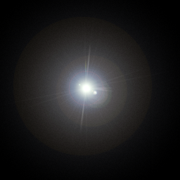
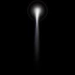
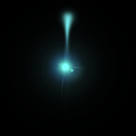

Ogre Material Cookbook
======================

Ogre supports pbs and unlit implementations by default.

PBS
---

Transparency
^^^^^^^^^^^^

Simple transparent material.

.. code-block:: json

    {
        "blendblocks" :
        {
            "waterBlend" :
            {
                "dst_blend_factor" : "one"
            }
        },

        "pbs" :
        {
            "waterMaterial" :
            {
                "workflow" : "metallic",
                "diffuse" :
                {
                    "value": [0.1, 0.1, 1]
                },
                "transparency" :
                {
                    "value" : 1,
                    "mode" : "transparent"
                }
            }
        }
    }

The transparency of the object is applied based on the "transparency" entry.
A value of 1 makes the object more transparent and 0 makes it less.

The blendblock is necessary to make the transparency active.

Detail layers
^^^^^^^^^^^^^

Detail layers are used to provide additional detail to an existing material.
For instance, they are useful for showing things like dirt or blemishes on a character's face, where the standard diffuse and normal textures have been used for the face itself.
Detail layers allow themselves to be tiled, scaled and offsetted, which makes them useful for animation.

This material uses two normal maps to produce a scrolling water effect.

.. code-block:: json

    {
        "blendblocks" :
        {
            "waterBlend" :
            {
                "dst_blend_factor" : "one"
            }
        },

        "pbs" :
        {
            "waterMaterial" :
            {
                "blendblock": "waterBlend",
                "workflow" : "metallic",
                "diffuse" :
                {
                    "value": [0.1, 0.1, 1]
                },
                "detail_normal0":{
                    "value" : 2,
                    "texture": "SeaPattern.tga"
                },
                "detail_normal1":{
                    "value" : 1,
                    "texture": "SmallWaves.tga"
                },
                "transparency" :
                {
                    "value" : 1.0,
                    "mode" : "Transparent"
                }
            }
        }
    }

Tiling Textures
^^^^^^^^^^^^^^^

Sampler blocks can be used to tile textures. By default they will be clamped.
Detail diffuse is used because it allows scale to be specified.

.. code-block:: json

    {
        "samplers" :
        {
            "wrapSampler" :
            {
                "u" : "wrap",
                "v" : "wrap",
                "w" : "wrap"
            }
        },

        "pbs" :
        {
            "testingFloor" :
            {
                "workflow" : "metallic",
                "detail_diffuse0" :
                {
                    "scale": [15, 15],
                    "texture": "checkerPattern.png",
                    "sampler": "wrapSampler"
                }
            }
        }
    }

Unlit
-----

Diffuse Layers
^^^^^^^^^^^^^^

Unlit datablocks can be decorated with different layers.

.. code-block:: json

    {
        "unlit" :
        {
            "colourExample" :
            {
                "diffuse": [0.5, 1, 1, 1],
                "diffuse_map0" :
                {
                    "texture": "flare.png",
                    "blendmode": "Add"
                },
                "diffuse_map1" :
                {
                    "texture": "flaretrail.png",
                    "blendmode": "Add"
                }
            }
        }
    }

In this example two images are layered ontop of each other.
The blendmode 'Add' is used, which simply adds the current layer's pixel values to the image so far.
This means black backgrounds are removed and used as alpha.

Up to 15 diffuse layers can be supplied, meaning lots of combinations can occur.

A diffuse colour is also applied.
This is applied after the diffuse maps are processed, in this case giving the final image a blue tint.
